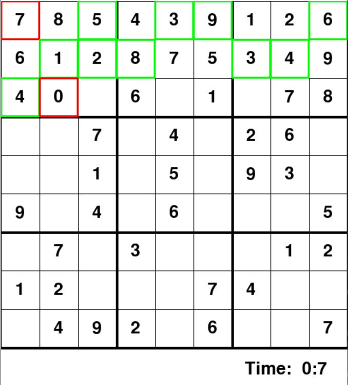
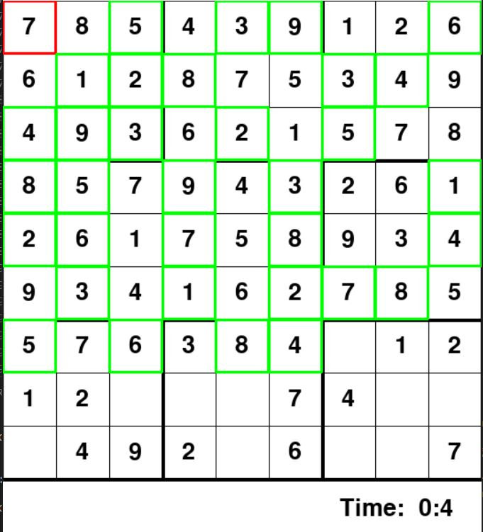

# Sudoku Solver with Backtracking Algorithm and Graphical User Interface
## 1. INTRODUCTION.
The objective of this repository is to make and show a system that solves sudokus with the backtracking algorithm, but besides, to learn and practice the Graphical User Interface with pygame. Backtracking is an algorithmic-technique for solving problems recursively by trying to build a solution incrementally, one piece at a time, removing those solutions that fail to satisfy the constraints of the problem at any point of time. We could say that we are going to solve the sudokus by trial and error and brute force.

## 2. CODE
### 2.1. solveSudoku1.0.py
This program is a testing/first version of the program. It solves the soduku and print it in the terminal in a basic way.
### 2.2. solveSudoku2.0.py
This program is the final version of the proyect. Running it, a nice interface appears. If the user selects a square, he or she can try to guess the number by pressing the enter key. If the user fails a cross will appear in the bottom-left corner. Ther will be as many as fails. Pressing the space key the sudoku will be solved automatically by the backtracking algorithm. It is slowed down to be able to look how the algorithm works.

  

  
